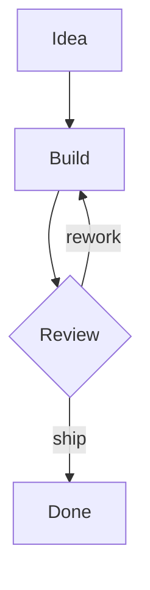
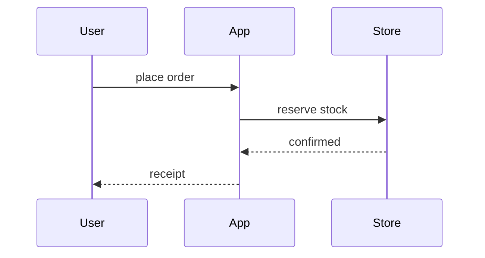
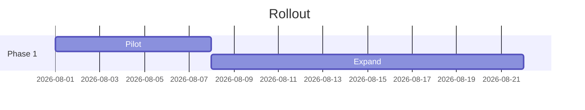
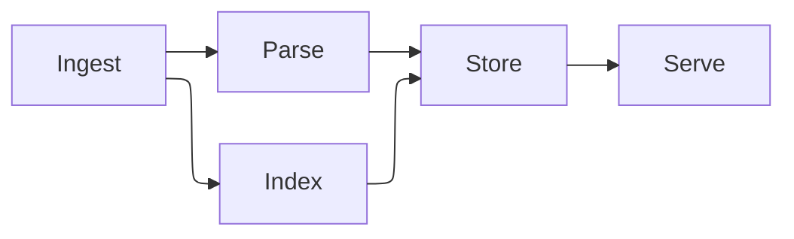

# Systems map

How the demo product's pieces talk to each other. The flowchart below uses the
default layout; the last one uses ELK, which proves the optional engine loads.

## Order flow

## Rollout

## Complex layout (ELK)

