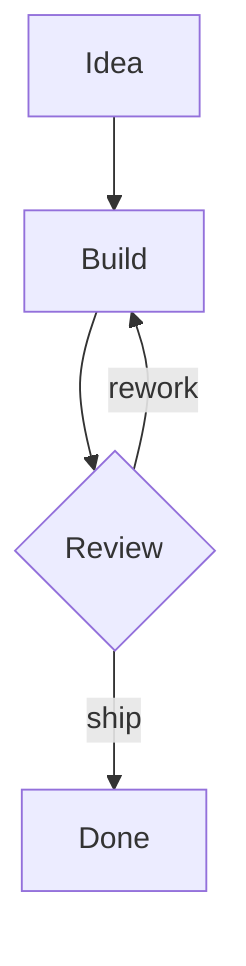
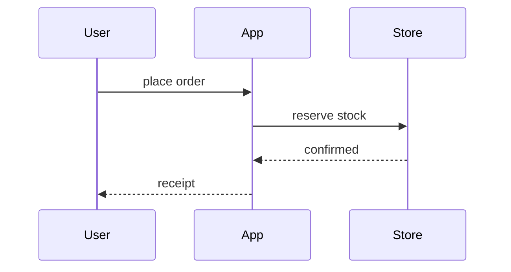
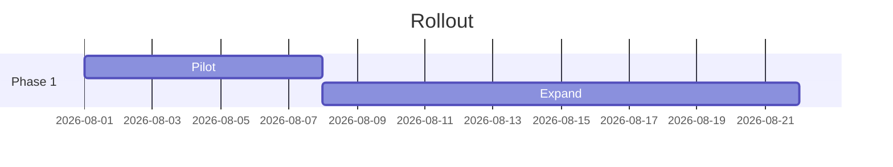
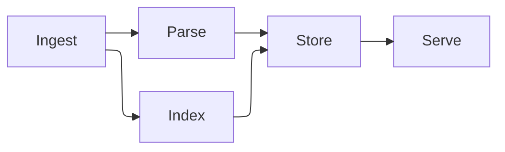

# M29 Stage A — Mermaid Render Core, All Surfaces, Viewer (M29.1–M29.8)

> **For agentic workers:** REQUIRED SUB-SKILL: Use superpowers:subagent-driven-development (recommended) or superpowers:executing-plans to implement this plan task-by-task. Steps use checkbox (`- [ ]`) syntax for tracking.

**Goal:** One shared mermaid render service themed by Cerebro tokens, diagrams rendering on every markdown surface (docs, notes, knowledge concepts), and a lightbox viewer with zoom/pan and SVG/PNG export.

**Architecture:** New `src/mermaid/` module owns rendering (`render.ts` + `theme.ts`), the universal read-only component (`MermaidDiagram`), export plumbing (`export.ts` + one new Rust command), and the lightbox. The editor's `MermaidView` moves here and delegates rendering to the core. Surfaces call components; nothing outside `src/mermaid/` imports `mermaid` directly.

**Tech Stack:** mermaid 11.16 (already a dep), `@mermaid-js/layout-elk` (new, lazy chunk), BlockNote glue unchanged, Tauri dialog plugin (present) + `base64` crate (new, Rust) for PNG save.

**Spec:** `docs/superpowers/specs/2026-08-08-cerebro-m29-mermaid-design.md`

**A note on `dangerouslySetInnerHTML` in this plan:** mermaid output is injected as HTML in three components below. This is the repo's existing, commented pattern (blocks.tsx:211): every render goes through the shared service at `securityLevel: 'strict'`, where mermaid sanitizes its own SVG. No other HTML source ever reaches these sinks; keep it that way and keep the in-code safety comments.

---

## Read this first — repo traps that will bite you

1. **Branch:** create `m29-mermaid` off `main` **after M21 merges** (these docs ride the M21 branch). Commits: `feat(mermaid): <sentence> (M29.<n>)`.
2. **`pnpm test` is watch mode and never exits.** Always `pnpm test:run` (or `pnpm test:run <file>`).
3. **jsdom cannot lay out SVG.** Real `mermaid.render` inside vitest hangs or garbage-renders. Unit tests ALWAYS mock either the `mermaid` module or `@/mermaid/render`. Only e2e (real Chromium) renders diagrams for real.
4. **Zero-warning lint** (`pnpm lint`), Prettier 100 cols single quotes (`pnpm format`), every `eslint-disable` carries a written reason.
5. **Store-layer error invariant:** nothing here throws to callers; render errors are values.
6. **mock parity:** every new IPC command in `src/lib/ipc.ts` needs a matching exported function in `src/lib/mockIpc.ts` (they are plain exported functions, imported as a namespace).
7. **demo-vault is the golden corpus** — dev, vitest, and Playwright all run against it. Only Task A8 touches it; treat that as a test change.
8. **Dark mode exists** (M16.39, `<html data-theme>`). Theme is read live from tokens; the render cache keys on the resolved palette. e2e pins `cerebro.themeMode = 'light'` in boot — copy the smoke spec's boot verbatim.
9. **Suffix every commit with the milestone phase** and never `--no-verify`.

## File structure (Stage A end state)

```
src/mermaid/
  theme.ts              tokens → mermaid themeVariables (+ cache signature)
  theme.test.ts
  render.ts             the ONE render service (lazy mermaid + ELK, cache, typed errors)
  render.test.ts
  useThemeEpoch.ts      bumps on <html data-theme> change
  MermaidDiagram.tsx    universal read-only renderer (fit, expand hook, error card)
  MermaidDiagram.test.tsx
  export.ts             svg→png bytes, clipboard copy, save-via-ipc
  export.test.ts
  MermaidLightbox.tsx   Dialog-based viewer: zoom/pan + copy/export toolbar
  MermaidLightbox.test.tsx
  MermaidBlockView.tsx  the editor block body (moved from src/editor/blocks.tsx)
  MermaidBlockView.test.tsx
src/editor/blocks.tsx   loses MermaidView; keeps a 6-line MermaidBlock spec importing the view
src/knowledge/ConceptBody.tsx   mermaid fences → <MermaidDiagram>
src/lib/ipc.ts + src/lib/mockIpc.ts   exportPng()
src-tauri/src/lib.rs    export_png command
demo-vault/strategy/systems-map.md   corpus doc (Task A8 only)
e2e/diagrams.spec.ts
```

---

### Task A1: Dependencies + `theme.ts` (M29.1)

**Files:**
- Modify: `package.json` (via pnpm)
- Create: `src/mermaid/theme.ts`
- Create: `src/mermaid/theme.test.ts`

- [ ] **Step 1: Add the ELK layout dependency**

```bash
pnpm add @mermaid-js/layout-elk
```

Expected: lockfile updates; a version compatible with mermaid ^11.16 resolves. (`shiki` comes in Stage B, not now.)

- [ ] **Step 2: Write the failing test**

Create `src/mermaid/theme.test.ts`:

```ts
import { describe, expect, it } from 'vitest';
import { buildThemeVariables, themeSignature } from './theme';

describe('buildThemeVariables', () => {
  it('uses light-palette fallbacks when tokens are absent (jsdom loads no stylesheet)', () => {
    const vars = buildThemeVariables();
    expect(vars.background).toBe('#ffffff');
    expect(vars.primaryBorderColor).toBe('#3d5bde');
    expect(vars.fontFamily).toContain('Instrument Sans');
  });

  it('reads live token values over fallbacks', () => {
    document.documentElement.style.setProperty('--n-0', '#123456');
    try {
      expect(buildThemeVariables().background).toBe('#123456');
    } finally {
      document.documentElement.style.removeProperty('--n-0');
    }
  });

  it('signature changes when the palette changes', () => {
    const light = themeSignature(buildThemeVariables());
    document.documentElement.style.setProperty('--n-0', '#15181f');
    try {
      expect(themeSignature(buildThemeVariables())).not.toBe(light);
    } finally {
      document.documentElement.style.removeProperty('--n-0');
    }
  });
});
```

- [ ] **Step 3: Run it to make sure it fails**

Run: `pnpm test:run src/mermaid/theme.test.ts`
Expected: FAIL — `Cannot find module './theme'`.

- [ ] **Step 4: Implement `src/mermaid/theme.ts`**

```ts
/**
 * Mermaid theme variables derived from Cerebro's design tokens (M29.1).
 *
 * Read at render time, not import time: `getComputedStyle` resolves whatever
 * palette `<html data-theme>` currently selects (M16.39 added dark), so
 * diagrams follow a theme flip without knowing themes exist. Fallbacks are
 * the light values from `src/styles/tokens/colors.css`, for environments
 * that load no stylesheet (vitest).
 */

export function buildThemeVariables(): Record<string, string> {
  const style = getComputedStyle(document.documentElement);
  const token = (name: string, fallback: string): string => {
    const v = style.getPropertyValue(name).trim();
    return v === '' ? fallback : v;
  };
  const ink = token('--n-800', '#272d3b');
  const nodeFill = token('--cortex-50', '#eef1fe');
  const nodeBorder = token('--cortex-500', '#3d5bde');
  return {
    fontFamily: token('--font-ui', "'Instrument Sans', -apple-system, 'Segoe UI', sans-serif"),
    fontSize: '13px',
    background: token('--n-0', '#ffffff'),
    primaryColor: nodeFill,
    primaryTextColor: ink,
    primaryBorderColor: nodeBorder,
    secondaryColor: token('--n-50', '#f6f7fa'),
    tertiaryColor: token('--n-25', '#fbfbfd'),
    lineColor: token('--n-400', '#888fa3'),
    textColor: ink,
    mainBkg: nodeFill,
    nodeBorder: nodeBorder,
    clusterBkg: token('--n-25', '#fbfbfd'),
    clusterBorder: token('--n-200', '#e3e6ee'),
    edgeLabelBackground: token('--n-0', '#ffffff'),
  };
}

/** Cache key component: same code under a different palette must not reuse an SVG. */
export function themeSignature(vars: Record<string, string>): string {
  return Object.values(vars).join('|');
}
```

- [ ] **Step 5: Run the tests and make sure they pass**

Run: `pnpm test:run src/mermaid/theme.test.ts`
Expected: 3 passed.

- [ ] **Step 6: Commit**

```bash
git add package.json pnpm-lock.yaml src/mermaid/theme.ts src/mermaid/theme.test.ts
git commit -m "feat(mermaid): diagram theme is derived from the app's own tokens (M29.1)"
```

---

### Task A2: `render.ts` — the one render service (M29.2)

**Files:**
- Create: `src/mermaid/render.ts`
- Create: `src/mermaid/render.test.ts`

- [ ] **Step 1: Write the failing test**

Create `src/mermaid/render.test.ts`. The `mermaid` module is mocked — see trap #3. Module state (cache, memoized loader) is reset by re-importing per test.

```ts
import { beforeEach, describe, expect, it, vi } from 'vitest';

const renderSpy = vi.fn();
const initializeSpy = vi.fn();
const registerSpy = vi.fn();

vi.mock('mermaid', () => ({
  default: {
    initialize: (...a: unknown[]) => initializeSpy(...a),
    render: (...a: unknown[]) => renderSpy(...a),
    registerLayoutLoaders: (...a: unknown[]) => registerSpy(...a),
  },
}));
vi.mock('@mermaid-js/layout-elk', () => ({ default: [] }));

async function freshModule() {
  vi.resetModules();
  return import('./render');
}

beforeEach(() => {
  renderSpy.mockReset().mockResolvedValue({ svg: '<svg data-fake="1"></svg>' });
  initializeSpy.mockReset();
  registerSpy.mockReset();
});

describe('renderMermaid', () => {
  it('renders through mermaid with strict security and base theme', async () => {
    const { renderMermaid } = await freshModule();
    const result = await renderMermaid('graph TD\n  A --> B');
    expect(result).toEqual({ ok: true, svg: '<svg data-fake="1"></svg>' });
    expect(initializeSpy).toHaveBeenCalledWith(
      expect.objectContaining({ securityLevel: 'strict', theme: 'base', startOnLoad: false }),
    );
    expect(registerSpy).toHaveBeenCalledTimes(1);
  });

  it('returns errors as values with the parse line extracted', async () => {
    renderSpy.mockRejectedValue(new Error('Parse error on line 3:\n...bad...'));
    const { renderMermaid } = await freshModule();
    const result = await renderMermaid('graph TD\n  A -->');
    expect(result).toEqual({
      ok: false,
      message: 'Parse error on line 3:\n...bad...',
      line: 3,
    });
  });

  it('serves repeat renders of the same code from the cache', async () => {
    const { renderMermaid } = await freshModule();
    await renderMermaid('graph TD\n  A --> B');
    await renderMermaid('graph TD\n  A --> B');
    expect(renderSpy).toHaveBeenCalledTimes(1);
  });
});

describe('extractErrorLine', () => {
  it('finds the line in mermaid parse errors', async () => {
    const { extractErrorLine } = await freshModule();
    expect(extractErrorLine('Parse error on line 7:\nxyz')).toBe(7);
    expect(extractErrorLine('Error: something else entirely')).toBeNull();
  });
});
```

- [ ] **Step 2: Run it to make sure it fails**

Run: `pnpm test:run src/mermaid/render.test.ts`
Expected: FAIL — `Cannot find module './render'`.

- [ ] **Step 3: Implement `src/mermaid/render.ts`**

```ts
import { buildThemeVariables, themeSignature } from './theme';

/**
 * The one mermaid entry point (M29.2). Everything that renders a diagram —
 * doc blocks, knowledge concepts, the lightbox — goes through here, so
 * security level, theme, layout engines, and caching are decided exactly once.
 *
 * Errors are values, never throws — the store-layer ethos applied to a
 * renderer. `line` is best-effort: mermaid's parse errors carry
 * "Parse error on line N:" and nothing else structured.
 */
export type RenderResult =
  | { ok: true; svg: string }
  | { ok: false; message: string; line: number | null };

export function extractErrorLine(message: string): number | null {
  const m = message.match(/error on line (\d+)/i);
  return m === null ? null : Number(m[1]);
}

let mermaidPromise: Promise<typeof import('mermaid').default> | null = null;

async function loadMermaid(): Promise<typeof import('mermaid').default> {
  // Lazy: mermaid is ~1MB and only needed when a diagram is on screen. ELK
  // loaders are registered up front but the elk engine itself is a further
  // lazy chunk mermaid pulls only when a diagram asks for `layout: elk`.
  mermaidPromise ??= (async () => {
    const mermaid = (await import('mermaid')).default;
    const { default: elkLayouts } = await import('@mermaid-js/layout-elk');
    mermaid.registerLayoutLoaders(elkLayouts);
    return mermaid;
  })();
  return mermaidPromise;
}

const CACHE_MAX = 50;
const cache = new Map<string, RenderResult>();
let seq = 0;

export async function renderMermaid(code: string): Promise<RenderResult> {
  const vars = buildThemeVariables();
  const key = `${themeSignature(vars)} ${code}`;
  const hit = cache.get(key);
  if (hit !== undefined) return hit;

  let result: RenderResult;
  try {
    const mermaid = await loadMermaid();
    // initialize() before every render: it is a cheap config assign, and the
    // theme may have flipped since the last call. The palette is app-global,
    // so interleaved renders still agree on the variables.
    mermaid.initialize({
      startOnLoad: false,
      securityLevel: 'strict',
      theme: 'base',
      themeVariables: vars,
    });
    const { svg } = await mermaid.render(`cerebro-mermaid-${++seq}`, code);
    result = { ok: true, svg };
  } catch (err) {
    const message = err instanceof Error ? err.message : String(err);
    result = { ok: false, message, line: extractErrorLine(message) };
  }

  if (cache.size >= CACHE_MAX) {
    const oldest = cache.keys().next().value;
    if (oldest !== undefined) cache.delete(oldest);
  }
  cache.set(key, result);
  return result;
}
```

- [ ] **Step 4: Run the tests and make sure they pass**

Run: `pnpm test:run src/mermaid/render.test.ts`
Expected: 4 passed. If the elk types complain under `pnpm typecheck`, the package ships its own d.ts — check the import name matches its `exports` (default export of layout loader definitions).

- [ ] **Step 5: Typecheck**

Run: `pnpm typecheck`
Expected: clean.

- [ ] **Step 6: Commit**

```bash
git add src/mermaid/render.ts src/mermaid/render.test.ts
git commit -m "feat(mermaid): one render service — strict, token-themed, cached, ELK-ready (M29.2)"
```

---

### Task A3: `MermaidDiagram` universal component + theme epoch (M29.3)

**Files:**
- Create: `src/mermaid/useThemeEpoch.ts`
- Create: `src/mermaid/MermaidDiagram.tsx`
- Create: `src/mermaid/MermaidDiagram.test.tsx`

- [ ] **Step 1: Write the failing test**

Create `src/mermaid/MermaidDiagram.test.tsx`:

```tsx
import { render, screen, waitFor } from '@testing-library/react';
import userEvent from '@testing-library/user-event';
import { describe, expect, it, vi } from 'vitest';
import { MermaidDiagram } from './MermaidDiagram';
import { renderMermaid } from './render';

vi.mock('./render', () => ({
  renderMermaid: vi.fn(),
}));
const renderMock = vi.mocked(renderMermaid);

describe('MermaidDiagram', () => {
  it('renders the svg once the service resolves', async () => {
    renderMock.mockResolvedValue({ ok: true, svg: '<svg data-fake="a"></svg>' });
    render(<MermaidDiagram code={'graph TD\n  A --> B'} />);
    await waitFor(() =>
      expect(screen.getByTestId('mermaid-diagram').innerHTML).toContain('data-fake="a"'),
    );
  });

  it('shows the error card with message and source on failure', async () => {
    renderMock.mockResolvedValue({ ok: false, message: 'Parse error on line 2:', line: 2 });
    render(<MermaidDiagram code={'graph TD\n  A -->'} />);
    await waitFor(() => expect(screen.getByTestId('mermaid-error')).toBeInTheDocument());
    expect(screen.getByTestId('mermaid-error').textContent).toContain('Parse error on line 2:');
    expect(screen.getByTestId('mermaid-error').textContent).toContain('A -->');
  });

  it('offers Expand only when a handler is given, and passes the svg', async () => {
    renderMock.mockResolvedValue({ ok: true, svg: '<svg data-fake="b"></svg>' });
    const onExpand = vi.fn();
    const { rerender } = render(<MermaidDiagram code="graph TD" onExpand={onExpand} />);
    await waitFor(() => screen.getByTestId('mermaid-diagram'));
    await userEvent.click(screen.getByRole('button', { name: 'Expand diagram' }));
    expect(onExpand).toHaveBeenCalledWith('<svg data-fake="b"></svg>');

    rerender(<MermaidDiagram code="graph TD" />);
    expect(screen.queryByRole('button', { name: 'Expand diagram' })).toBeNull();
  });
});
```

- [ ] **Step 2: Run it to make sure it fails**

Run: `pnpm test:run src/mermaid/MermaidDiagram.test.tsx`
Expected: FAIL — module not found.

- [ ] **Step 3: Implement `src/mermaid/useThemeEpoch.ts`**

```ts
import { useEffect, useState } from 'react';

/**
 * Bumps whenever `<html data-theme>` changes (M16.39's toggle, or the system
 * resolver), so token-derived renders can redo themselves. A MutationObserver
 * rather than a store subscription: this module must work on surfaces that
 * take only props (ConceptBody), and the attribute is the one place every
 * theme decision already lands.
 */
export function useThemeEpoch(): number {
  const [epoch, setEpoch] = useState(0);
  useEffect(() => {
    const observer = new MutationObserver(() => setEpoch((n) => n + 1));
    observer.observe(document.documentElement, {
      attributes: true,
      attributeFilter: ['data-theme'],
    });
    return () => observer.disconnect();
  }, []);
  return epoch;
}
```

- [ ] **Step 4: Implement `src/mermaid/MermaidDiagram.tsx`**

```tsx
import { useEffect, useRef, useState } from 'react';
import { Icon } from '@/components/ui/Icon';
import { renderMermaid, type RenderResult } from './render';
import { useThemeEpoch } from './useThemeEpoch';

/**
 * The universal read-only diagram (M29.3): every surface that shows rendered
 * markdown uses this one component, so fit, errors, and theme-following are
 * decided once. Hosts that can open the lightbox pass `onExpand`; the current
 * svg rides along so the lightbox never re-renders the diagram.
 */
export function MermaidDiagram({
  code,
  onExpand,
  collapseHeight = 480,
}: {
  code: string;
  onExpand?: (svg: string) => void;
  collapseHeight?: number;
}) {
  const [result, setResult] = useState<RenderResult | null>(null);
  const themeEpoch = useThemeEpoch();
  const generation = useRef(0);

  useEffect(() => {
    const gen = ++generation.current;
    void renderMermaid(code).then((r) => {
      // A stale resolve must not clobber a newer render (code changed, or
      // the theme flipped while mermaid was working).
      if (generation.current === gen) setResult(r);
    });
  }, [code, themeEpoch]);

  if (result === null) {
    return <div data-testid="mermaid-loading" className="min-h-12 w-full" aria-busy="true" />;
  }

  if (!result.ok) {
    return (
      <div
        data-testid="mermaid-error"
        className="w-full rounded-lg border border-danger-500/40 bg-danger-50 px-3 py-2"
      >
        <div className="text-xs text-danger-700">{result.message}</div>
        <pre className="mt-1 overflow-x-auto [font-family:var(--font-mono)] text-xs leading-[18px] text-n-600">
          {code}
        </pre>
      </div>
    );
  }

  const svg = result.svg;
  return (
    <div className="group relative w-full" data-testid="mermaid-diagram">
      <div
        className="overflow-auto [&_svg]:h-auto [&_svg]:max-w-full"
        style={{ maxHeight: collapseHeight }}
        // Safe: mermaid runs at securityLevel 'strict' and sanitizes its output.
        dangerouslySetInnerHTML={{ __html: svg }}
      />
      {onExpand !== undefined && (
        <button
          type="button"
          aria-label="Expand diagram"
          onClick={() => onExpand(svg)}
          className="absolute right-1.5 top-1.5 hidden rounded-md border border-n-200 bg-n-0 p-1 group-hover:block hover:bg-n-50"
        >
          <Icon name="maximize-2" size={13} color="var(--n-500)" />
        </button>
      )}
    </div>
  );
}
```

- [ ] **Step 5: Run the tests and make sure they pass**

Run: `pnpm test:run src/mermaid/MermaidDiagram.test.tsx`
Expected: 3 passed.

- [ ] **Step 6: Commit**

```bash
git add src/mermaid/useThemeEpoch.ts src/mermaid/MermaidDiagram.tsx src/mermaid/MermaidDiagram.test.tsx
git commit -m "feat(mermaid): one read-only diagram component for every surface (M29.3)"
```

---

### Task A4: Export plumbing — svg→png, clipboard, save command (M29.4)

**Files:**
- Create: `src/mermaid/export.ts`
- Create: `src/mermaid/export.test.ts`
- Modify: `src/lib/ipc.ts` (append)
- Modify: `src/lib/mockIpc.ts` (append)
- Modify: `src-tauri/src/lib.rs` (new command + registration)
- Modify: `src-tauri/Cargo.toml` (base64 crate)

- [ ] **Step 1: Write the failing TS test**

Create `src/mermaid/export.test.ts`:

```ts
import { describe, expect, it, vi } from 'vitest';
import { copySvg, viewBoxSize } from './export';

describe('viewBoxSize', () => {
  it('reads intrinsic size from the viewBox', () => {
    expect(viewBoxSize('<svg viewBox="0 0 320 180"></svg>')).toEqual({ width: 320, height: 180 });
  });
  it('falls back to a sane default when absent', () => {
    expect(viewBoxSize('<svg></svg>')).toEqual({ width: 800, height: 600 });
  });
});

describe('copySvg', () => {
  it('writes the svg text to the clipboard', async () => {
    const writeText = vi.fn().mockResolvedValue(undefined);
    vi.stubGlobal('navigator', { ...navigator, clipboard: { writeText } });
    await copySvg('<svg/>');
    expect(writeText).toHaveBeenCalledWith('<svg/>');
    vi.unstubAllGlobals();
  });
});
```

(`svgToPngBytes` and `copyPng` need a real canvas — jsdom has none. They are exercised by e2e/live checks; the pure `viewBoxSize` seam is what unit tests pin.)

- [ ] **Step 2: Run it to make sure it fails**

Run: `pnpm test:run src/mermaid/export.test.ts`
Expected: FAIL — module not found.

- [ ] **Step 3: Implement `src/mermaid/export.ts`**

```ts
import { exportPng as ipcExportPng } from '@/lib/ipc';

/**
 * Diagram export (M29.4). SVG is the lossless copy; PNG rasterises at 2×
 * through an offscreen canvas. Mermaid svgs are viewBox-sized (no width/height
 * attributes), and an  from such an svg reports 0×0 in some engines —
 * so intrinsic size comes from the viewBox, not the image.
 */
export function viewBoxSize(svg: string): { width: number; height: number } {
  const m = svg.match(/viewBox="[\d.-]+[ ,]+[\d.-]+[ ,]+([\d.]+)[ ,]+([\d.]+)"/);
  if (m === null) return { width: 800, height: 600 };
  return { width: Math.ceil(Number(m[1])), height: Math.ceil(Number(m[2])) };
}

export async function svgToPngBytes(svg: string, scale = 2): Promise<Uint8Array> {
  const { width, height } = viewBoxSize(svg);
  const url = URL.createObjectURL(new Blob([svg], { type: 'image/svg+xml;charset=utf-8' }));
  try {
    const img = new Image();
    await new Promise<void>((resolve, reject) => {
      img.onload = () => resolve();
      img.onerror = () => reject(new Error('SVG failed to rasterise'));
      img.src = url;
    });
    const canvas = document.createElement('canvas');
    canvas.width = Math.max(1, width * scale);
    canvas.height = Math.max(1, height * scale);
    const ctx = canvas.getContext('2d');
    if (ctx === null) throw new Error('canvas 2d unavailable');
    ctx.drawImage(img, 0, 0, canvas.width, canvas.height);
    const blob = await new Promise<Blob | null>((resolve) => canvas.toBlob(resolve, 'image/png'));
    if (blob === null) throw new Error('PNG encode failed');
    return new Uint8Array(await blob.arrayBuffer());
  } finally {
    URL.revokeObjectURL(url);
  }
}

export async function copySvg(svg: string): Promise<void> {
  await navigator.clipboard.writeText(svg);
}

export async function copyPng(svg: string): Promise<void> {
  const bytes = await svgToPngBytes(svg);
  await navigator.clipboard.write([
    new ClipboardItem({ 'image/png': new Blob([bytes], { type: 'image/png' }) }),
  ]);
}

/** Save through the native dialog. Resolves to the chosen path, or null on cancel. */
export async function savePng(svg: string, defaultName: string): Promise<string | null> {
  const bytes = await svgToPngBytes(svg);
  return ipcExportPng(defaultName, bytes);
}
```

- [ ] **Step 4: Append `exportPng` to `src/lib/ipc.ts`**

Follow the file's existing pattern exactly (`inTauri() ? invokeTauri(...) : mock.<fn>(...)`). Append at the end:

```ts
/**
 * Save PNG bytes via the native save dialog (M29.4). Base64 because Tauri's
 * JSON invoke channel has no efficient raw-bytes lane for commands; diagrams
 * are small enough that this does not matter. Returns the chosen absolute
 * path, or null when the user cancels.
 */
export function exportPng(defaultName: string, bytes: Uint8Array): Promise<string | null> {
  let binary = '';
  for (let i = 0; i < bytes.length; i += 0x8000) {
    binary += String.fromCharCode(...bytes.subarray(i, i + 0x8000));
  }
  const bytesBase64 = btoa(binary);
  return inTauri()
    ? invokeTauri('export_png', { defaultName, bytesBase64 })
    : mock.exportPng(defaultName, bytes);
}
```

- [ ] **Step 5: Append the mock to `src/lib/mockIpc.ts`**

Mirror the browser reality: no native dialog exists, so the mock downloads via an anchor — dev and Playwright still exercise the flow.

```ts
/** Browser stand-in for the native PNG save: a plain download. */
export async function exportPng(defaultName: string, bytes: Uint8Array): Promise<string | null> {
  const url = URL.createObjectURL(new Blob([new Uint8Array(bytes)], { type: 'image/png' }));
  const a = document.createElement('a');
  a.href = url;
  a.download = defaultName;
  a.click();
  URL.revokeObjectURL(url);
  return defaultName;
}
```

- [ ] **Step 6: Add the Rust command**

In `src-tauri/Cargo.toml` under `[dependencies]` add:

```toml
base64 = "0.22"
```

In `src-tauri/src/lib.rs`, next to `pick_files` (same dialog-plugin style, ~line 197):

```rust
/// Save PNG bytes wherever the user points the native dialog (M29.4).
/// Cancel is `Ok(None)` — not an error — mirroring `pick_files`.
#[tauri::command]
async fn export_png(
    app: tauri::AppHandle,
    default_name: String,
    bytes_base64: String,
) -> Result<Option<String>, String> {
    use base64::Engine as _;
    let bytes = base64::engine::general_purpose::STANDARD
        .decode(bytes_base64)
        .map_err(|e| e.to_string())?;
    let Some(picked) = app
        .dialog()
        .file()
        .set_file_name(&default_name)
        .add_filter("PNG image", &["png"])
        .blocking_save_file()
    else {
        return Ok(None);
    };
    let path = picked.into_path().map_err(|e| e.to_string())?;
    std::fs::write(&path, bytes).map_err(|e| e.to_string())?;
    Ok(Some(path.to_string_lossy().to_string()))
}
```

Register `export_png,` in the `invoke_handler` list (~line 365, next to `pick_files`).

- [ ] **Step 7: Run TS tests + Rust checks**

Run: `pnpm test:run src/mermaid/export.test.ts` — Expected: 3 passed.
Run: `cd src-tauri && cargo clippy --all-targets -- -D warnings && cargo test` — Expected: clean (the dialog path is manual/live; base64 decode is the crate's covered behavior).

- [ ] **Step 8: Typecheck + lint**

Run: `pnpm typecheck && pnpm lint`
Expected: clean.

- [ ] **Step 9: Commit**

```bash
git add src/mermaid/export.ts src/mermaid/export.test.ts src/lib/ipc.ts src/lib/mockIpc.ts src-tauri/src/lib.rs src-tauri/Cargo.toml src-tauri/Cargo.lock
git commit -m "feat(mermaid): copy and export diagrams as SVG and PNG (M29.4)"
```

---

### Task A5: `MermaidLightbox` — zoom, pan, export toolbar (M29.5)

**Files:**
- Create: `src/mermaid/MermaidLightbox.tsx`
- Create: `src/mermaid/MermaidLightbox.test.tsx`

- [ ] **Step 1: Write the failing test**

```tsx
import { fireEvent, render, screen } from '@testing-library/react';
import userEvent from '@testing-library/user-event';
import { describe, expect, it, vi } from 'vitest';
import { MermaidLightbox } from './MermaidLightbox';

vi.mock('./export', () => ({
  copySvg: vi.fn().mockResolvedValue(undefined),
  copyPng: vi.fn().mockResolvedValue(undefined),
  savePng: vi.fn().mockResolvedValue('/tmp/x.png'),
}));

import { copySvg } from './export';

describe('MermaidLightbox', () => {
  const svg = '<svg data-fake="z"></svg>';

  it('renders the svg and a 100% zoom readout', () => {
    render(<MermaidLightbox open svg={svg} title="Diagram" onClose={() => {}} />);
    expect(screen.getByTestId('lightbox-canvas').innerHTML).toContain('data-fake="z"');
    expect(screen.getByRole('button', { name: 'Reset zoom' }).textContent).toContain('100%');
  });

  it('zoom buttons change the scale readout', async () => {
    render(<MermaidLightbox open svg={svg} title="Diagram" onClose={() => {}} />);
    await userEvent.click(screen.getByRole('button', { name: 'Zoom in' }));
    expect(screen.getByRole('button', { name: 'Reset zoom' }).textContent).toContain('110%');
    await userEvent.click(screen.getByRole('button', { name: 'Reset zoom' }));
    expect(screen.getByRole('button', { name: 'Reset zoom' }).textContent).toContain('100%');
  });

  it('wheel zooms the canvas', () => {
    render(<MermaidLightbox open svg={svg} title="Diagram" onClose={() => {}} />);
    fireEvent.wheel(screen.getByTestId('lightbox-viewport'), { deltaY: -1 });
    expect(screen.getByRole('button', { name: 'Reset zoom' }).textContent).toContain('110%');
  });

  it('copy SVG goes through the export module', async () => {
    render(<MermaidLightbox open svg={svg} title="Diagram" onClose={() => {}} />);
    await userEvent.click(screen.getByRole('button', { name: 'Copy SVG' }));
    expect(vi.mocked(copySvg)).toHaveBeenCalledWith(svg);
  });
});
```

- [ ] **Step 2: Run it to make sure it fails**

Run: `pnpm test:run src/mermaid/MermaidLightbox.test.tsx`
Expected: FAIL — module not found.

- [ ] **Step 3: Implement `src/mermaid/MermaidLightbox.tsx`**

Built on the existing `Dialog` primitive (`src/components/ui/Dialog.tsx`) — it already owns scrim, Escape-via-layers (M16.1), and focus restore; a bespoke overlay would re-answer questions the layers stack settled.

```tsx
import { useRef, useState } from 'react';
import { Button } from '@/components/ui/Button';
import { Dialog } from '@/components/ui/Dialog';
import { Icon } from '@/components/ui/Icon';
import { useUiStore } from '@/stores/uiStore';
import { copyPng, copySvg, savePng } from './export';

const MIN_SCALE = 0.25;
const MAX_SCALE = 4;

/**
 * Diagram viewer (M29.5): zoom (buttons + wheel), drag-to-pan, copy/export.
 * Receives the already-rendered svg — it never re-renders the diagram, so
 * opening it is instant and cannot fail.
 */
export function MermaidLightbox({
  open,
  svg,
  title,
  onClose,
}: {
  open: boolean;
  svg: string;
  title: string;
  onClose: () => void;
}) {
  const toast = useUiStore((s) => s.toast);
  const [scale, setScale] = useState(1);
  const [offset, setOffset] = useState({ x: 0, y: 0 });
  const drag = useRef<{ startX: number; startY: number; baseX: number; baseY: number } | null>(
    null,
  );

  const zoomBy = (factor: number) =>
    setScale((s) => Math.min(MAX_SCALE, Math.max(MIN_SCALE, s * factor)));

  const act = (label: string, run: () => Promise<unknown>) => {
    void run()
      .then(() => toast(label))
      .catch(() => toast(`${label.split(' ')[0]} failed`));
  };

  return (
    <Dialog open={open} onClose={onClose} title={title} width={960}>
      <div className="mb-2 flex items-center gap-1.5">
        <Button variant="ghost" aria-label="Zoom out" onClick={() => zoomBy(1 / 1.1)}>
          <Icon name="zoom-out" size={14} color="var(--n-600)" />
        </Button>
        <Button
          variant="ghost"
          aria-label="Reset zoom"
          onClick={() => {
            setScale(1);
            setOffset({ x: 0, y: 0 });
          }}
        >
          {Math.round(scale * 100)}%
        </Button>
        <Button variant="ghost" aria-label="Zoom in" onClick={() => zoomBy(1.1)}>
          <Icon name="zoom-in" size={14} color="var(--n-600)" />
        </Button>
        <span className="flex-1" />
        <Button variant="secondary" onClick={() => act('SVG copied', () => copySvg(svg))}>
          Copy SVG
        </Button>
        <Button variant="secondary" onClick={() => act('PNG copied', () => copyPng(svg))}>
          Copy PNG
        </Button>
        <Button variant="secondary" onClick={() => act('PNG saved', () => savePng(svg, 'diagram.png'))}>
          Save PNG…
        </Button>
      </div>
      <div
        data-testid="lightbox-viewport"
        className="relative h-[60vh] cursor-grab overflow-hidden rounded-lg border border-n-200 bg-n-25 active:cursor-grabbing"
        onWheel={(e) => {
          e.preventDefault();
          zoomBy(e.deltaY < 0 ? 1.1 : 1 / 1.1);
        }}
        onPointerDown={(e) => {
          e.currentTarget.setPointerCapture(e.pointerId);
          drag.current = { startX: e.clientX, startY: e.clientY, baseX: offset.x, baseY: offset.y };
        }}
        onPointerMove={(e) => {
          if (drag.current === null) return;
          setOffset({
            x: drag.current.baseX + (e.clientX - drag.current.startX),
            y: drag.current.baseY + (e.clientY - drag.current.startY),
          });
        }}
        onPointerUp={() => {
          drag.current = null;
        }}
      >
        <div
          data-testid="lightbox-canvas"
          className="[&_svg]:h-auto [&_svg]:max-w-none"
          style={{
            transform: `translate(${offset.x}px, ${offset.y}px) scale(${scale})`,
            transformOrigin: '0 0',
          }}
          // Safe: same strict-mode mermaid output the inline view showed.
          dangerouslySetInnerHTML={{ __html: svg }}
        />
      </div>
    </Dialog>
  );
}
```

Check `ButtonProps` (`src/components/ui/Button.tsx:31`) before writing: variants are `primary | secondary | ghost | danger`; if it lacks an `aria-label` passthrough or has a required size prop, adjust to its real API — do not extend the primitive.

- [ ] **Step 4: Run the tests and make sure they pass**

Run: `pnpm test:run src/mermaid/MermaidLightbox.test.tsx`
Expected: 4 passed.

- [ ] **Step 5: Commit**

```bash
git add src/mermaid/MermaidLightbox.tsx src/mermaid/MermaidLightbox.test.tsx
git commit -m "feat(mermaid): lightbox viewer — zoom, pan, copy, export (M29.5)"
```

---

### Task A6: Move the editor block view onto the core (M29.6)

**Files:**
- Create: `src/mermaid/MermaidBlockView.tsx` (moved + rewired from `src/editor/blocks.tsx`)
- Create: `src/mermaid/MermaidBlockView.test.tsx`
- Modify: `src/editor/blocks.tsx` (delete `MermaidView`, import the moved view)

The current `MermaidView` (blocks.tsx:117-231) owns its own mermaid import, init, and error truncation. All of that dies; rendering goes through the core. Edit UX (textarea + Done) is unchanged in this task — Stage B replaces it; keeping this diff mechanical makes both reviews easy.

- [ ] **Step 1: Write the failing test**

Create `src/mermaid/MermaidBlockView.test.tsx`:

```tsx
import { render, screen, waitFor } from '@testing-library/react';
import userEvent from '@testing-library/user-event';
import { describe, expect, it, vi } from 'vitest';
import { MermaidBlockView } from './MermaidBlockView';

vi.mock('./render', () => ({ renderMermaid: vi.fn() }));
import { renderMermaid } from './render';
const renderMock = vi.mocked(renderMermaid);

describe('MermaidBlockView', () => {
  it('renders the diagram through the core service', async () => {
    renderMock.mockResolvedValue({ ok: true, svg: '<svg data-fake="c"></svg>' });
    render(<MermaidBlockView code={'graph TD\n  A --> B'} onChangeCode={() => {}} />);
    await waitFor(() =>
      expect(screen.getByTestId('mermaid-block').innerHTML).toContain('data-fake="c"'),
    );
  });

  it('starts in editing mode when the code is empty', () => {
    render(<MermaidBlockView code="" onChangeCode={() => {}} />);
    expect(screen.getByLabelText('Mermaid source')).toBeInTheDocument();
  });

  it('commits the draft on Done', async () => {
    renderMock.mockResolvedValue({ ok: true, svg: '<svg></svg>' });
    const onChangeCode = vi.fn();
    render(<MermaidBlockView code="" onChangeCode={onChangeCode} />);
    await userEvent.type(screen.getByLabelText('Mermaid source'), 'graph TD');
    await userEvent.click(screen.getByRole('button', { name: 'Done' }));
    expect(onChangeCode).toHaveBeenCalledWith('graph TD');
  });

  it('surfaces the full render error, not just its first line', async () => {
    renderMock.mockResolvedValue({
      ok: false,
      message: 'Parse error on line 2:\nExpecting …',
      line: 2,
    });
    render(<MermaidBlockView code={'graph TD\n  A -->'} onChangeCode={() => {}} />);
    await waitFor(() =>
      expect(screen.getByTestId('mermaid-block').textContent).toContain('line 2'),
    );
  });

  it('opens the lightbox from the preview', async () => {
    renderMock.mockResolvedValue({ ok: true, svg: '<svg data-fake="d"></svg>' });
    render(<MermaidBlockView code="graph TD" onChangeCode={() => {}} />);
    await waitFor(() => screen.getByTestId('mermaid-diagram'));
    await userEvent.hover(screen.getByTestId('mermaid-diagram'));
    await userEvent.click(screen.getByRole('button', { name: 'Expand diagram' }));
    expect(screen.getByTestId('lightbox-canvas')).toBeInTheDocument();
  });
});
```

- [ ] **Step 2: Run it to make sure it fails**

Run: `pnpm test:run src/mermaid/MermaidBlockView.test.tsx`
Expected: FAIL — module not found.

- [ ] **Step 3: Implement `src/mermaid/MermaidBlockView.tsx`**

```tsx
import { useState } from 'react';
import { Icon } from '@/components/ui/Icon';
import { MermaidDiagram } from './MermaidDiagram';
import { MermaidLightbox } from './MermaidLightbox';

/**
 * The mermaid block's body (M29.6) — moved out of editor/blocks.tsx so the
 * editor keeps only BlockNote glue. Rendering goes through the shared core;
 * this file owns block chrome and the edit lifecycle. Stage B replaces the
 * textarea toggle with side-by-side live editing; Stage C adds the structural
 * editor. Both land here.
 */
export function MermaidBlockView({
  code,
  onChangeCode,
}: {
  code: string;
  onChangeCode: (code: string) => void;
}) {
  const [editing, setEditing] = useState(code.trim() === '');
  const [draft, setDraft] = useState(code);
  const [lightboxSvg, setLightboxSvg] = useState<string | null>(null);

  const commit = () => {
    setEditing(false);
    if (draft !== code) onChangeCode(draft);
  };

  return (
    <div
      data-testid="mermaid-block"
      contentEditable={false}
      className="my-1 w-full rounded-lg border border-n-200 bg-n-0"
    >
      <div className="flex items-center gap-1.5 border-b border-n-100 px-2.5 py-1">
        <Icon name="waypoints" size={13} color="var(--n-500)" />
        <span className="text-xs font-medium uppercase tracking-[0.05em] text-n-500">Mermaid</span>
        <span className="flex-1" />
        <button
          type="button"
          // Without this the textarea blurs FIRST, commit() flips `editing`
          // false, and the click then lands on the (now) "Edit" branch —
          // reopening the source box the button just closed.
          onMouseDown={(e) => e.preventDefault()}
          onClick={() => {
            if (editing) commit();
            else {
              setDraft(code);
              setEditing(true);
            }
          }}
          className="rounded-md border-0 bg-transparent px-1.5 py-0.5 text-xs text-n-500 hover:bg-n-50 hover:text-n-800"
        >
          {editing ? 'Done' : 'Edit'}
        </button>
      </div>

      {editing && (
        <textarea
          autoFocus
          aria-label="Mermaid source"
          value={draft}
          placeholder={'graph TD\n  A[Idea] --> B[Shipped]'}
          onChange={(e) => setDraft(e.target.value)}
          onBlur={commit}
          onKeyDown={(e) => e.stopPropagation()}
          rows={Math.max(4, draft.split('\n').length + 1)}
          className="w-full resize-y border-0 bg-n-25 px-3 py-2 [font-family:var(--font-mono)] text-sm leading-[1.5] text-n-800 outline-none"
        />
      )}

      {!editing && code.trim() !== '' && (
        <div className="px-3 py-2">
          <MermaidDiagram code={code} onExpand={(svg) => setLightboxSvg(svg)} />
        </div>
      )}

      {!editing && code.trim() === '' && (
        <button
          type="button"
          onClick={() => {
            setDraft(code);
            setEditing(true);
          }}
          className="w-full border-0 bg-transparent px-3 py-3 text-left text-sm text-n-400"
        >
          Empty diagram — click to add mermaid source
        </button>
      )}

      {lightboxSvg !== null && (
        <MermaidLightbox
          open
          svg={lightboxSvg}
          title="Diagram"
          onClose={() => setLightboxSvg(null)}
        />
      )}
    </div>
  );
}
```

- [ ] **Step 4: Rewire `src/editor/blocks.tsx`**

Delete `MermaidView` and the `mermaidId` counter (lines 115-231). Replace the `MermaidBlock` spec's render with the import:

```tsx
import { MermaidBlockView } from '@/mermaid/MermaidBlockView';

export const MermaidBlock = createReactBlockSpec(
  {
    type: 'mermaid',
    propSchema: { code: { default: '' } },
    content: 'none',
  },
  {
    render: (props) => (
      <MermaidBlockView
        code={props.block.props.code as string}
        onChangeCode={(code) => props.editor.updateBlock(props.block, { props: { code } } as never)}
      />
    ),
  },
);
```

Also drop the now-unused `useEffect`/`useRef` imports if nothing else in the file uses them.

- [ ] **Step 5: Run the full unit suite**

Run: `pnpm test:run`
Expected: all pass — `MarkdownEditor.test.tsx` and `markdown.test.ts` exercise the block round-trip and must be untouched by this move. If a test referenced the old error-truncation behavior, update it to the full-message expectation.

- [ ] **Step 6: Lint + typecheck, then commit**

Run: `pnpm lint && pnpm typecheck`

```bash
git add src/mermaid/MermaidBlockView.tsx src/mermaid/MermaidBlockView.test.tsx src/editor/blocks.tsx
git commit -m "refactor(mermaid): the editor block renders through the shared core (M29.6)"
```

---

### Task A7: Knowledge concepts render diagrams (M29.7)

**Files:**
- Modify: `src/knowledge/ConceptBody.tsx` (fence branch, ~line 172)
- Modify: its test file (check the actual name with `ls src/knowledge/`)

- [ ] **Step 1: Write the failing test**

Add to the ConceptBody test file (mock the core — trap #3):

```tsx
vi.mock('@/mermaid/render', () => ({
  renderMermaid: vi.fn().mockResolvedValue({ ok: true, svg: '<svg data-fake="k"></svg>' }),
}));
```

```tsx
it('renders mermaid fences as diagrams, other fences as code', async () => {
  const markdown = [
    '```mermaid',
    'graph TD',
    '  A --> B',
    '```',
    '',
    '```ts',
    'const x = 1;',
    '```',
  ].join('\n');
  render(<ConceptBody markdown={markdown} sources={[]} fromPath="knowledge/x.md" />);
  await waitFor(() =>
    expect(screen.getByTestId('mermaid-diagram').innerHTML).toContain('data-fake="k"'),
  );
  expect(screen.getByText('const x = 1;')).toBeInTheDocument();
});
```

Match how sibling tests construct `ConceptBodyProps` (`sources`, `fromPath`, click handlers).

- [ ] **Step 2: Run it to make sure it fails**

Run: `pnpm test:run src/knowledge/`
Expected: the new test FAILS (fence renders as `<pre>`), existing ones pass.

- [ ] **Step 3: Implement the fence branch**

In `ConceptBody.tsx`, add the imports and a tiny stateful wrapper (the body builder is a plain function, so lightbox state needs a component):

```tsx
import { MermaidDiagram } from '@/mermaid/MermaidDiagram';
import { MermaidLightbox } from '@/mermaid/MermaidLightbox';
```

```tsx
/** A concept's diagram: read-only render + lightbox. */
function ConceptMermaid({ code }: { code: string }) {
  const [svg, setSvg] = useState<string | null>(null);
  return (
    <div className="my-3">
      <MermaidDiagram code={code} onExpand={(s) => setSvg(s)} />
      {svg !== null && (
        <MermaidLightbox open svg={svg} title="Diagram" onClose={() => setSvg(null)} />
      )}
    </div>
  );
}
```

(Add `useState` to the react import.) Then, inside the fence branch — after the closing-fence consume, before the `<pre>` push — route on the captured language:

```tsx
if (fence[1] === 'mermaid') {
  blocks.push(<ConceptMermaid key={key++} code={code.join('\n')} />);
  continue;
}
```

The existing `<pre>` path stays for every other language.

- [ ] **Step 4: Run the tests and make sure they pass**

Run: `pnpm test:run src/knowledge/`
Expected: all pass.

- [ ] **Step 5: Commit**

```bash
git add src/knowledge/
git commit -m "feat(knowledge): concepts render mermaid fences as diagrams (M29.7)"
```

---

### Task A8: Golden corpus + e2e (M29.8)

**Files:**
- Create: `demo-vault/strategy/systems-map.md` (**test change** — the corpus is shared by dev/vitest/Playwright)
- Create: `e2e/diagrams.spec.ts`

- [ ] **Step 1: Add the corpus doc**

Create `demo-vault/strategy/systems-map.md` (plain doc, H1 title, no frontmatter — matches `delivery/how-we-schedule.md`):

````markdown
# Systems map

How the demo product's pieces talk to each other. The flowchart below uses the
default layout; the last one uses ELK, which proves the optional engine loads.



## Order flow



## Rollout



## Complex layout (ELK)


````

- [ ] **Step 2: Write the e2e spec**

Create `e2e/diagrams.spec.ts`. Boot is copied from `e2e/smoke.spec.ts` (distiller off, theme pinned light — do not improvise). For navigation, copy the quick-open idiom from `smoke.spec.ts` (it quick-opens by title near its end) — the shortcut below is illustrative; use whatever the smoke spec actually does:

```ts
import { test, expect } from '@playwright/test';

test('mermaid renders in docs, and the lightbox zooms', async ({ page }) => {
  await page.addInitScript(() => {
    window.localStorage.setItem('cerebro.autoLearn', 'false');
    window.localStorage.setItem('cerebro.themeMode', 'light');
  });
  await page.goto('/');

  const demoButton = page.getByRole('button', { name: 'Open demo vault' });
  const sidebarTypes = page.getByTestId('sidebar-type');
  await expect(demoButton.or(sidebarTypes.first())).toBeVisible({ timeout: 10_000 });
  if (await demoButton.isVisible()) {
    await demoButton.click();
  }

  // Open the corpus doc through quick open (same idiom as smoke.spec.ts).
  await page.keyboard.press('Meta+p');
  await page.keyboard.type('Systems map');
  await page.keyboard.press('Enter');

  // All four fences render as diagrams — including the ELK one, which proves
  // the lazy layout chunk loads.
  const diagrams = page.getByTestId('mermaid-diagram');
  await expect(diagrams).toHaveCount(4, { timeout: 20_000 });
  await expect(diagrams.first().locator('svg')).toBeVisible();
  await expect(diagrams.nth(3).locator('svg')).toBeVisible();

  // Lightbox: expand the first diagram, zoom in, readout moves.
  await diagrams.first().hover();
  await page.getByRole('button', { name: 'Expand diagram' }).first().click();
  await expect(page.getByTestId('lightbox-canvas').locator('svg')).toBeVisible();
  await page.getByRole('button', { name: 'Zoom in' }).click();
  await expect(page.getByRole('button', { name: 'Reset zoom' })).toContainText('110%');
  await page.keyboard.press('Escape');
  await expect(page.getByTestId('lightbox-canvas')).toHaveCount(0);
});
```

- [ ] **Step 3: Run e2e**

Run: `PORT=5273 pnpm e2e -- diagrams.spec.ts`
(Memory: a stale HMR'd dev server on :5173 fails whole suites at boot; the PORT override sidesteps it.)
Expected: 1 passed. Then the full `PORT=5273 pnpm e2e` — the corpus edit may shift counts in other specs; fix any assertion the new file legitimately changed (e.g. doc counts in sidebars).

- [ ] **Step 4: Full gate**

Run: `pnpm lint && pnpm typecheck && pnpm test:run && pnpm test:coverage`
Expected: clean; coverage not below the ratchet.

- [ ] **Step 5: Commit**

```bash
git add demo-vault/strategy/systems-map.md e2e/diagrams.spec.ts
git commit -m "test(mermaid): golden corpus doc and render/lightbox e2e (M29.8)"
```

---

## Stage A exit criteria

- Every ` ```mermaid ` fence in docs, notes, and knowledge concepts renders a themed diagram.
- The old hardcoded `neutral` theme and per-block mermaid imports are gone; `src/mermaid/render.ts` is the only importer of `mermaid`.
- Lightbox zooms/pans; Copy SVG / Copy PNG / Save PNG work in the packaged app (live-check Save PNG once via `./scripts/mac-build.sh` — Playwright cannot exercise the native dialog).
- `pnpm lint && pnpm typecheck && pnpm test:run && PORT=5273 pnpm e2e` all green; `cd src-tauri && cargo test && cargo clippy --all-targets -- -D warnings` green.
